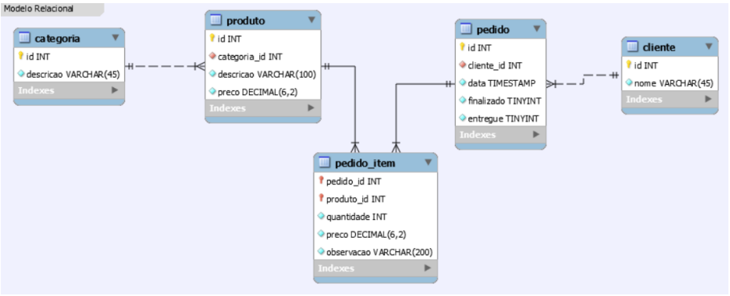
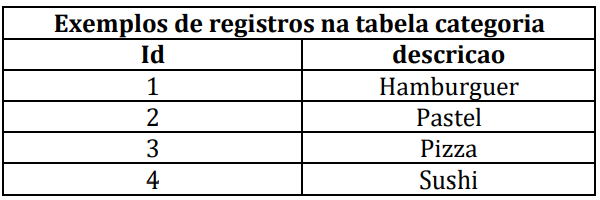
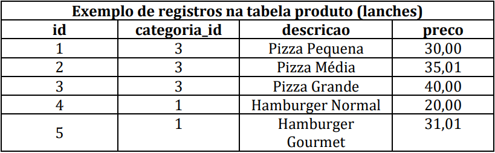
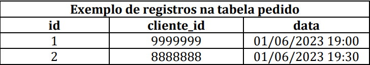
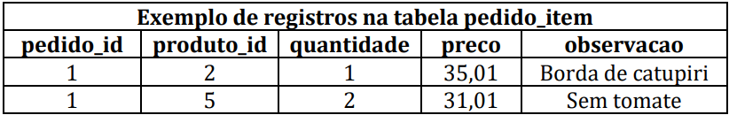
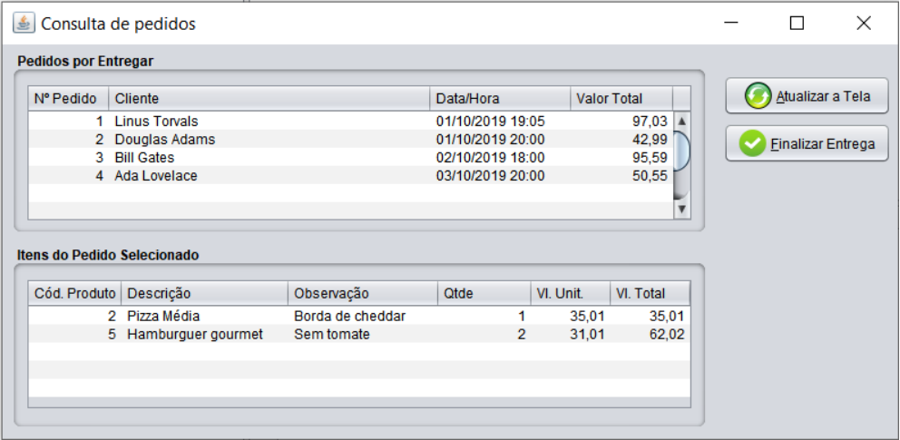

# Trabalho Programação Avancada

<h2> Especificação </h2>

A cada dia mais pessoas escolhem a praticidade de pedir comida utilizando o celular. Por outro lado, alguns usuários de Smartfones estão cansados de terem que instalar aplicativos diferentes o tempo todo, então alguns restaurantes optam por interagir com os seus clientes por meio dos aplicativos de trocas de mensagens instantâneas, o que demanda de um funcionário somente para isso. Sabendo disso, sua empresa enxerga uma oportunidade de negócio e resolve disponibilizar um sistema com um ChatBot para fazer pedidos pelo Telegram.
  
ChatBot é um programa de computador que tenta simular um ser humano na conversação com as pessoas. Seu grupo deve criar um Bot no aplicativo Telegram (forme o grupo de modo que ao menos um integrante tenha o aplicativo). É preciso abrir o Telegram, localizar o perfil “BotFather” e enviar o comando /newbot. Depois, precisa especificar um nome, como por exemplo “LancheriaMilliway” e um nome de usuário (que termine com a palavra bot, por exemplo “LancheriaMilliwaybot”). 
  
Por fim, você receberá um token para utilizar no seu programa Java o qual acessa o Bot via API e responde as requisições do usuário. A documentação de uso da API está disponível em https://core.telegram.org/api. Você pode escolher entre utilizar uma biblioteca pronta, código de terceiros ou desenvolver seu próprio código para a parte da comunicação. 
  
Os dados serão armazenados em um banco de dados cujo modelo relacional é apresentado a seguir:

A tabela cliente vai armazenar os dados de todos os usuários que entrarem em contato pelo aplicativo (inserção automática). As tabelas categoria e produto terão seus dados mantidos pelo dono do restaurante de forma que você precisa fazer as telas de cadastro.

A seguir são apresentados exemplos de registros nessas tabelas.

 As tabelas pedido e pedido_item serão preenchidas durante a interação do usuário com o Bot. As tabelas a seguir exibem exemplos de registros.

O programa deve ter no mínimo as seguintes telas:

<ul>
<li><b>(0,3 pts)</b> Manutenção de Categoria: permitir incluir, alterar e excluir categorias de lanches (somente será possível excluir se ainda não houver produto vinculado);</li>
<li><b>(0,7 pts)</b> Manutenção de Produtos (lanches): permitir incluir, alterar e excluir produtos (somente será possível excluir se ainda não estiver em algum pedido). Deve ser possível escolher a categoria em uma JComboBox.</li>
<li><b>(3,0 pts)</b> Consulta de pedidos: O sistema deve apresentar uma tela em formato
mestre-detalhe. Na primeira tabela exibir todos os pedidos que foram finalizados pelo
cliente, mas ainda não foram entregues. Na segunda tabela listar os itens do pedido
selecionado. Ao clicar no botão “Atualizar a Tela” deve ser refeita a consulta no BD. O
botão “Finalizar Entrega” deve atualizar o campo entregue=1 para o pedido selecionado e recarregar a tela (de forma que o pedido saia da tela). O layout deve ser semelhante ao apresentado a seguir:

</li>
<li><b>(2,0 pts)</b> A interação do cliente com o Bot ocorre da seguinte forma:    
<ol type="1">
<li>Cliente envia uma mensagem qualquer;</li>
<li>Bot insere o registro na tabela cliente (se ainda não houver esse id) e responde
com uma saudação padrão perguntando ao cliente qual categoria de lanches ele
gostaria de olhar (listando as opções);</li>
<li>Supondo que o cliente escolha ver a categoria 3 – pizzas;</li>
<li>O Bot responde com a lista de produtos desta categoria (código, descrição e
preço);</li>
<li>Supondo que o cliente escolha a opção 2 – Pizza Média;</li>
<li>O Bot pergunta a quantidade;</li>
<li>Supondo que o cliente responda 1;</li>
<li>O Bot pergunta se tem alguma observação;</li>
<li>Supondo que o cliente responda “Com borda de Cheddar”;</li>
<li>O Bot insere o corpo do pedido e o item de pedido e em seguida pergunta se o
cliente quer adicionar mais algum produto no pedido;</li>
<li>Se o cliente responder sim, exibe novamente as categorias e repete os passos a
partir do 3;</li>
<li>Se o cliente responder não, então atualiza o pedido como finalizado=1 e retorna
uma mensagem agradecendo o pedido e informando que poderá retirar em 40
minutos.</li>
</ol></li>
</ul>

Lembre-se que a cada interação o usuário pode informar uma entrada que não corresponde a um comando esperado. Então se o cliente informar na quantidade que quer “uma” ao invés de “1”, o Bot deveria ser inteligente o suficiente para tratar isso. Caso seja impossível interpretar o comando, retornar uma mensagem avisando que não entendeu e pedir a resposta novamente.

Lembre-se também que enquanto o Bot está respondendo a requisição do cliente 9999999, um outro cliente pode iniciar uma interação. Cada sequência de comandos deve ser gerenciada em um thread separado.

<h3>(1,0 pts) Avaliação geral da interface gráfica</h3>
<ul>
<li>Utilizar menus para acessar as telas</li>
<li> Layout deve permitir redimensionar a tela de forma adequada;</li>
<li>Utilizar ícones nos botões;</li>
<li>Utilizar teclas de atalho (Ctrl + I para incluir, Ctrl + S para salvar);</li>
<li>Utilizar textos de ajuda para documentar os controles e comandos da tela;</li>
</ul>

<h3>(2,0 pts) Avaliação geral do sistema</h3>
<ul>
<li>Correta separação em camadas;</li>
<li> Correta utilização do BD;</li>
<li>Correto tratamento de exceções;</li>
<li>Utilização de threads;</li>
<li>Documentação e organização do código;</li>
</ul>

<h3>(1,0 pts) Funcionalidade de livre escolha:</h3>

Escolha uma das funcionalidades a seguir ou valide
previamente com o professor caso tenha uma ideia diferente:

<ul>
<li>Exportação da consulta de pedidos em um arquivo PDF (dica: relatório iReport ou iText);</li>
<li>Envio alertas de pedidos para o celular do dono do restaurante;</li>
<li>Fotos dos produtos enviadas no Telegram;</li>
<li>Controle de pedido pronto (enviando mensagem para o cliente quando está pronto para
retirar);</li>
<li>Integração com ChatGPT.</li>
</ul>

<h3>Bom trabalho!!! </3>
